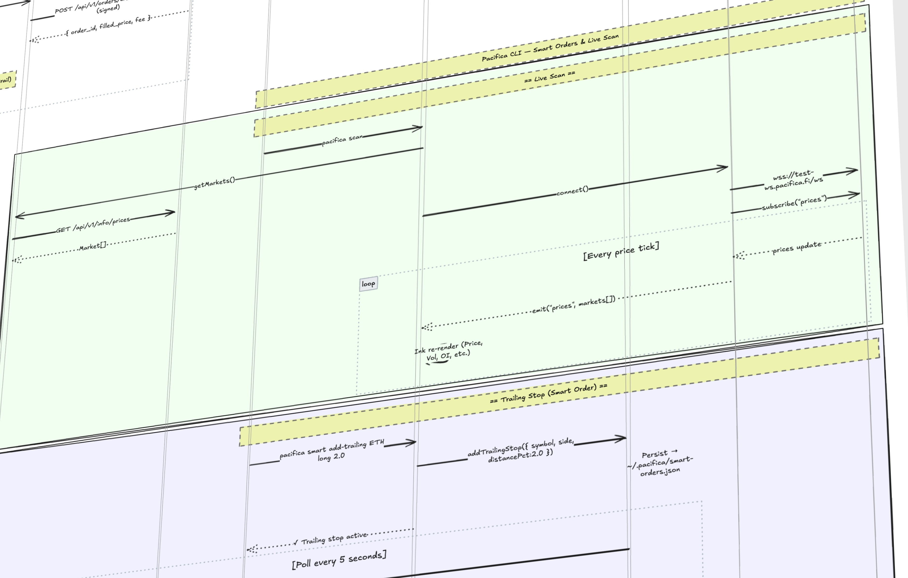

<div align="center">

# ⚡ Pacifica CLI

**Agent-native trading terminal for [Pacifica DEX](https://test-app.pacifica.fi)**

[](package.json)
[](package.json)
[](LICENSE)
[](src/mcp/server.ts)
[](https://solana.com)

*One codebase. Three interfaces. Full agent control.*

</div>

<div align="center">



</div>

---

## What is Pacifica CLI?

A terminal-first trading suite for the Pacifica perpetuals DEX — built for traders who live in the terminal and AI agents that need programmatic market access.

```
┌─────────────────────────────────────────────────────────────────┐
│                        pacifica scan                            │
├──────────┬──────────┬────────┬──────────────┬────────┬─────────┤
│ Symbol   │   Price  │  24h % │    Volume    │   OI   │ Funding │
├──────────┼──────────┼────────┼──────────────┼────────┼─────────┤
│ BTC-PERP │ 69,420   │ +2.4%  │  $48.2M      │ $120M  │ +0.01%  │
│ ETH-PERP │  3,852   │ +1.1%  │  $21.6M      │  $58M  │ +0.008% │
│ SOL-PERP │    182   │ -0.8%  │   $9.4M      │  $24M  │ -0.003% │
│ JTO-PERP │   4.21   │ +5.2%  │   $3.1M      │   $8M  │ +0.021% │
└──────────┴──────────┴────────┴──────────────┴────────┴─────────┘
                              Live  ●  testnet
```

---

## Three Interfaces, One Codebase

| Interface | Command | Purpose |
|-----------|---------|---------|
| **CLI / TUI** | `pacifica <cmd>` | Rich terminal UI — live markets, orders, positions, PnL |
| **MCP Server** | `pacifica-mcp` | 23 tools for AI agents (Claude, Cursor, any MCP client) |
| **Claude Skills** | `/scan`, `/trade`, `/journal` | Slash commands for agent-assisted workflows |

---

## Quick Start

### Step 1 — Activate your wallet

Before using the CLI, activate your wallet on the Pacifica testnet app:

1. Go to **[test-app.pacifica.fi](https://test-app.pacifica.fi)**
2. Connect your Solana wallet (Phantom, Backpack, etc.)
3. Enter access code: **`Pacifica`**
4. Use the **Faucet** to mint test USDP

### Step 2 — Install & configure

```bash
npm install -g pacifica-cli
pacifica init --testnet
```

The `init` wizard will ask for your private key and set safe defaults for leverage, slippage, and agent guardrails.

### Step 3 — Start trading

```bash
pacifica scan                          # live market feed
pacifica trade buy ETH 0.5 --lev 5    # place a market order
pacifica positions                     # view open positions
pacifica journal                       # PnL history & stats
```

---

## Command Reference

### Markets

```bash
pacifica scan                          # live prices, volume, funding, OI
pacifica funding                       # funding rates sorted by APR
```

### Trading

```bash
pacifica trade buy  <symbol> <size>    # market buy
pacifica trade sell <symbol> <size>    # market sell
pacifica trade buy  <symbol> <size> --limit <price>   # limit order
pacifica trade buy  <symbol> <size> --lev 10 --tp 4200 --sl 3600
```

### Orders & Positions

```bash
pacifica orders                        # list open orders
pacifica orders cancel <id>            # cancel one order
pacifica orders cancel-all [symbol]    # cancel all (or by symbol)

pacifica positions                     # open positions with PnL
pacifica positions close <symbol>      # close at market
pacifica heatmap                       # risk heatmap (live, color-coded)
```

### Smart Orders (Automation)

```bash
pacifica smart add-trailing <symbol> <distance%>     # trailing stop
pacifica smart add-partial-tp <symbol>               # multi-level take-profit
pacifica smart list                                   # active automations
pacifica smart cancel <id>                            # remove automation
```

### Journal & Analytics

```bash
pacifica journal                       # full trade history
pacifica journal --symbol ETH          # filter by market
pacifica journal --period week         # today / week / month / all
```

### Agent Control

```bash
pacifica agent status                  # guardrails, budget, recent actions
pacifica agent config                  # edit limits interactively
pacifica agent log                     # full audit trail
pacifica agent stop / start            # disable / enable agent trading
```

---

## AI Agent Integration (MCP)

Add to your Claude Desktop or Cursor config to give Claude full trading access with built-in guardrails:

```json
{
  "mcpServers": {
    "pacifica": {
      "command": "npx",
      "args": ["-y", "pacifica-cli", "--mcp"]
    }
  }
}
```

### Available MCP Tools

<table>
<tr><th>Category</th><th>Tools</th></tr>
<tr>
<td><b>Read (10)</b></td>
<td>
<code>get_markets</code> · <code>get_ticker</code> · <code>get_orderbook</code><br>
<code>get_positions</code> · <code>get_account</code> · <code>get_orders</code><br>
<code>get_order_history</code> · <code>get_trade_history</code><br>
<code>get_trades_stats</code> · <code>get_agent_status</code>
</td>
</tr>
<tr>
<td><b>Analytics (5)</b></td>
<td>
<code>get_funding_rates</code> · <code>analyze_risk</code><br>
<code>get_smart_orders</code> · <code>get_journal_stats</code><br>
<code>get_heatmap_data</code>
</td>
</tr>
<tr>
<td><b>Funding (2)</b></td>
<td>
<code>get_funding_history</code> · <code>analyze_funding_arb</code>
</td>
</tr>
<tr>
<td><b>Write (6)</b></td>
<td>
<code>place_order</code> · <code>close_position</code> · <code>cancel_order</code><br>
<code>set_position_tpsl</code> · <code>create_smart_order</code><br>
<code>cancel_smart_order</code>
</td>
</tr>
</table>

> **All write tools pass through the guardrail system** — order size limits, leverage caps, daily spending budget, and action whitelist are enforced on every agent call.

---

## Agent Safety Guardrails

Every agent action is checked before execution:

```
Agent call
   │
   ├─ ① Agent enabled?
   ├─ ② Action in blocked list?        → reject
   ├─ ③ Action in allowed list?        → reject if not
   ├─ ④ Order size ≤ max_order_size?   → reject if over
   ├─ ⑤ Leverage ≤ max_leverage?       → reject if over
   └─ ⑥ Daily spend + order ≤ budget?  → reject if over
          │
          └─ amount > confirm_threshold? → ask for confirmation
```

Configure limits in `~/.pacifica.yaml`:

```yaml
agent:
  enabled: true
  daily_spending_limit: 5000   # USD
  max_order_size: 2000         # USD per order
  max_leverage: 5
  allowed_actions:
    - place_order
    - close_position
    - cancel_order
    - set_tpsl
  require_confirmation_above: 1000
```

---

## Architecture

```
┌─────────────────────────────────────────────────────────────┐
│                        User / Agent                         │
└──────────────────┬───────────────────┬──────────────────────┘
                   │                   │
         ┌─────────▼──────┐   ┌────────▼────────┐
         │   CLI (TUI)    │   │   MCP Server    │
         │  Commander.js  │   │  stdio / tools  │
         │  Ink (React)   │   │   23 tools      │
         └─────────┬──────┘   └────────┬────────┘
                   │                   │
         ┌─────────▼───────────────────▼──────┐
         │             Core Layer              │
         │                                     │
         │  ┌───────────┐  ┌───────────────┐  │
         │  │  SDK      │  │   Agent       │  │
         │  │  Client   │  │   Guardrails  │  │
         │  │  Signer   │  │   Spending    │  │
         │  │  WS       │  │   Logger      │  │
         │  └─────┬─────┘  └───────────────┘  │
         │        │                            │
         │  ┌─────┴──────────────────────┐     │
         │  │  Smart Orders · Risk Calc  │     │
         │  │  Journal · Config          │     │
         │  └────────────────────────────┘     │
         └────────────────┬────────────────────┘
                          │
         ┌────────────────▼────────────────────┐
         │          Pacifica DEX API            │
         │   REST (signed Ed25519) + WebSocket  │
         │   Testnet: test-api.pacifica.fi      │
         │   Mainnet: api.pacifica.fi           │
         └─────────────────────────────────────┘
```

---

## Local Data Files

All data is stored locally — no external database required:

| File | Purpose |
|------|---------|
| `~/.pacifica.yaml` | Config: network, keys, agent limits |
| `~/.pacifica/spending.json` | Daily budget ledger (auto-resets midnight) |
| `~/.pacifica/agent-log.json` | Append-only audit trail of all agent actions |
| `~/.pacifica/journal.json` | Trade log: fills, closes, smart order triggers |
| `~/.pacifica/smart-orders.json` | Active trailing stops & partial take-profits |

> All files are created with `chmod 0o600` (owner read/write only).

---

## Built for The Synthesis Hackathon

| Track | Tech |
|-------|------|
| Pacifica DEX | Perpetuals trading, Ed25519 signing, WebSocket feeds |
| Claude MCP | 23 tools with full guardrail enforcement |
| Solana | Keypair auth, base58 encoding |
| Terminal UI | Ink (React-in-terminal), Commander.js |

---

<div align="center">

**[Pacifica DEX](https://test-app.pacifica.fi)** · **[Report an Issue](../../issues)** · **[The Synthesis Hackathon](https://synthesis.so)**

</div>
